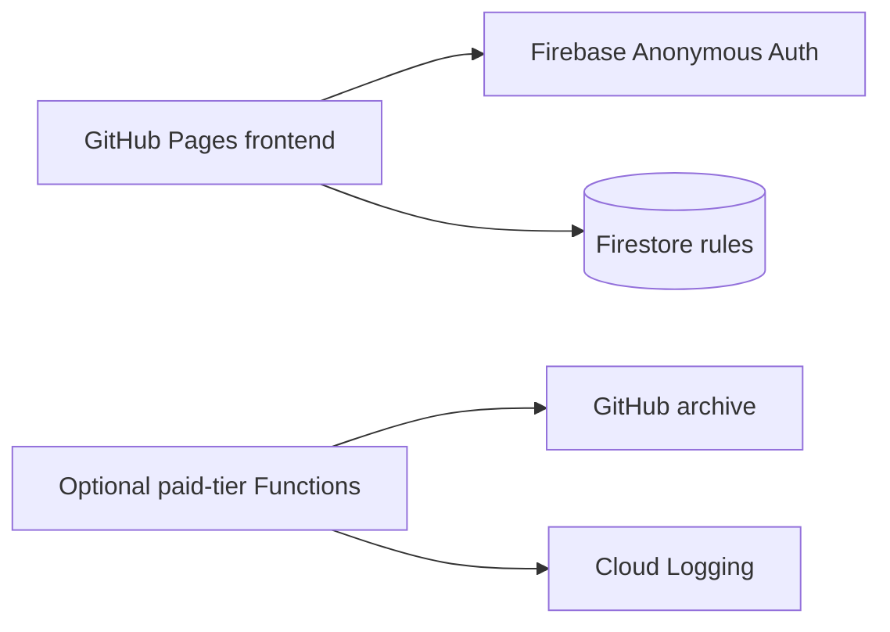

# HappyBirthday system architecture

## Decision

HappyBirthday uses a serverless Web2 architecture compatible with Firebase Spark. GitHub Pages delivers the static frontend, Firebase Web SDK and anonymous Auth provide controlled Firestore access, and Firestore is the system of record. Cloud Functions and GitHub archival remain optional for a future Blaze-plan upgrade.



## Repository layout

```text
HappyBirthday/
├── index.html                 # Hosted application shell
├── style.css                  # Hosted presentation layer
├── script.js                  # Legacy entrypoint retained for compatibility
├── frontend/                  # Browser services and reusable client modules
│   ├── api.js
│   ├── config.js
│   ├── storage.js
│   └── README.md
├── image/                     # Public birthday media
├── apis/                      # API contract documentation
├── backend/                   # Backend responsibility documentation
├── database/                  # Database responsibility documentation
│   └── firestore.rules        # Spark-compatible database policy
├── functions/
│   ├── index.js               # Cloud Functions entrypoint
│   ├── package.json
│   └── src/
│       ├── api.js             # HTTP contract and request handling
│       ├── backup.js          # GitHub archival adapter
│       ├── config.js          # Backend constants and trusted origins
│       ├── rate-limit.js      # In-memory abuse guard
│       ├── repository.js      # Firestore persistence
│       ├── validation.js      # Server-side input validation
│       └── validation.test.js  # Contract tests for input and IDs
├── firebase.json              # Functions and Firestore deployment config
├── ARCHITECTURE.md            # This document
└── .github/workflows/         # CI/CD deployment
```

## Data flow

1. The browser signs in anonymously with Firebase Auth.
2. Firestore rules allow authenticated public reads and validated creates only.
3. Firestore stores the wish with a server timestamp; updates and deletes are denied.
4. Local storage preserves the last successful read and pending writes during temporary network failure.
5. Optional Cloud Functions can later archive wishes to GitHub when a Blaze plan is enabled.

## Security boundaries

- Secrets belong only in Firebase Secret Manager (`GITHUB_BACKUP_TOKEN`) for the optional paid path.
- Firebase API configuration is public client configuration, not a credential.
- Firestore rules enforce authentication, field allowlisting, type checks, and length limits.
- Anonymous Auth prevents unauthenticated database access.
- GitHub Pages serves only static assets; the document CSP allowlists Firebase services.
- Browser privacy masking is a visual feature; it cannot prevent operating-system screenshots.

## Operational requirements

```powershell
firebase deploy --project happybirthday-6d8ee --only firestore:rules
```

Enable Anonymous sign-in in Firebase Authentication and GitHub Pages with GitHub Actions as the source. Spark limits still apply to Firestore reads/writes and Auth usage; monitor Firebase usage before any public campaign.

## Evolution path

Keep this as a serverless modular monolith until independent scaling or ownership is required. If moderation, notifications, analytics, or multiple products are added, extract those capabilities behind separate functions or services while retaining the same API contract and Firestore repository boundary.
